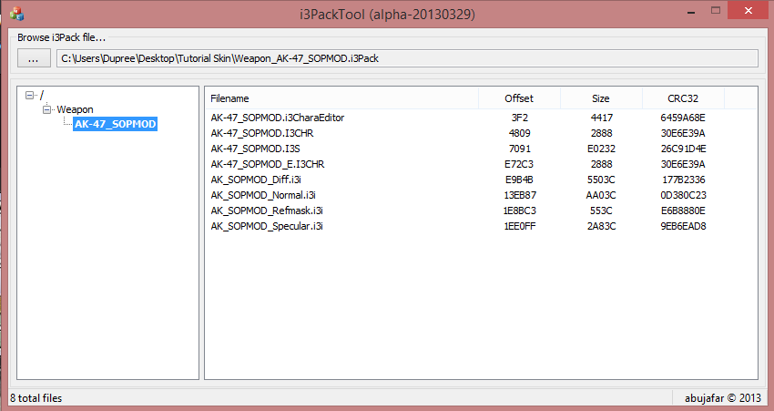
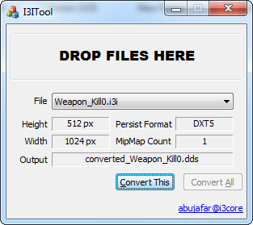
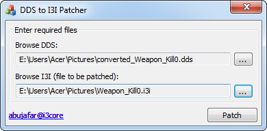

# Point Blank Modification Tools

It's time to release all my tools source codes. I can't keep it privately, there's no storage space to keep all anymore LOL

---

### I3PackTool
A tool to open and extract `.i3pack` files.
 

### I3ITool
A tool to convert `*.i3i` file you've got from extracted `*.i3pack` file to [**DirectDraw Surface**](https://en.wikipedia.org/wiki/DirectDraw_Surface) (`*.dds` file).

### DDSPatcher / DDSToI3I
A tool to convert `*.dds` to `*.i3i` format.

### BGMChanger
A tool to change default background sound using `*.ogg` format.

### ConfigEditor
A tool to edit encrypted config content (e.g. `lwsi_En.sif`)

### DeBitRotate
A tool just like **ConfigEditor**, but you can adjust shift key to find the correct shift key.

### PEFDecryptor
A tool to decrypt `*.pef` file.
